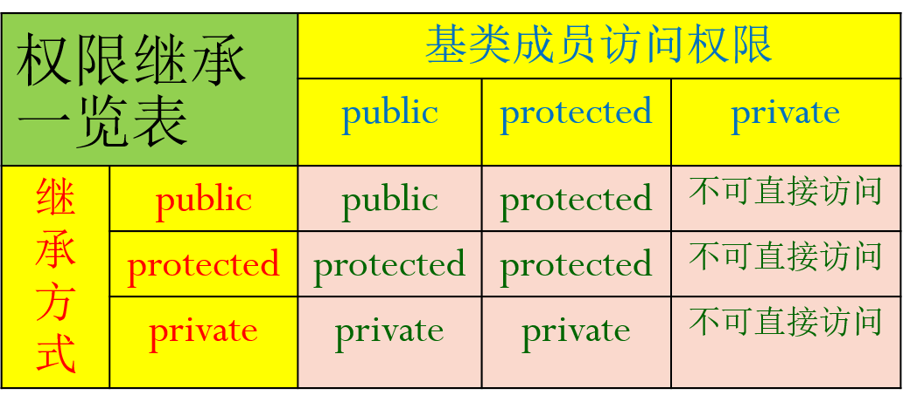

<center > 北京师范大学2018-2019学年第一学期 “C++程序设计” </center>

<center><font size=12><b>上机作业七</b></fontfont></center>


| 姓    名 |   学    号   |  日    期  |
| :------: | :----------: | :--------: |
|   袁宇昊   | 201611130126 | 2018.10.30 |


## 实验目的

* **类的继承与派生**。

* **学习const应用**。


##  实验总结：

**请在以下总结实验中发现的问题和解决办法或心得体会。请勿黏贴过多源码。**

 

1. **心得**：类继承中的权限总结

   

 这个图片就很好得解决了这个权限的问题。从图片上看到 private和protected在权限继承上有很大的不同之处，虽然他们俩在访问上是相似的，但在权限的继承上private显示出更限制的特点。

2. **问题**：派生类的构造函数出错。

```c++
Rectangle::Rectangle(const int xx,const int yy,const int ww,const int hh):
    w(ww),h(hh),
    x(xx),y(yy){}//erro
```

​	**解决**：因为x,y在派生类里面是不可直接访问的，所以会报错。改为用基类构造函数就可以了。相似的问题还有无参数构造函数和引用构造函数里会出现。

```c++
Rectangle::Rectangle(const int xx,const int yy,const int ww,const int hh):
    w(ww),h(hh),
    Shape(xx,yy){}
```
3. **问题**：在第一个题中的Rectangle类的Display函数中报错。
```c++
void Rectangle::Display()
{
    cout<<"Rectangle(("<<x<<","<<y<<")"<<w<<","<<h<<"),Area="<<Area()<<",Circum="<<Circum()<<endl;//x,y不可直接访问
}
```
   **解决**：
   第一次是想改用Shape类里面的Display()函数来代替对(x,y)的访问，但是这样的话会让显示的格式不对：
```c++
void Shape::Display()
{
    cout<<"Shape("<<x<<","<<y<<")"<<endl;
}
void Rectangle::Display()
{
    cout<<"Rectangle(";
    Shape::Display();
    cout<<w<<","<<h<<"),Area="<<Area()<<",Circum="<<Circum()<<endl;
}//显示出来是：Rectangle(Shape(x,y)【换行了】w,h),Area=area,Circum=circum
//多了一个Shape单词。
```
   第二次考虑在Shape中增加一个Display2()成员函数来只打印出(x,y)：
```c++
void Shape::Display2()
{
    cout<<"("<<x<<","<<y<<")";
}
void Rectangle::Display()
{
    cout<<"Rectangle(";
    Shape::Display2();
    cout<<w<<","<<h<<"),Area="<<Area()<<",Circum="<<Circum()<<endl;
}
```
这样就可以正确显示出所需要的结果了。
4. **心得**：关于const
   **先讨论函数的参数需不需要加const**
   构造函数中只需要用到传入的值，并不会更改传入的值，那么构造函数的参数都可以加上const,包括普通参数和引用参数。
   以Shape类为例，它所有的有参数的构造函数都加上了const：
```c++
class Shape
{
public:
    Shape(const int xx,const int yy);
    Shape(const Shape & a);
};
```
   然后是一些成员函数，一般也是不会改变传入的参数值，所以也都加上了const。
   还是以Shape类为例，它的成员函数都加上了const:
```c++
class Shape
{
public:
    void Move(const int xOff,const int yOff);
    void Set(const int xx,const int yy);
};
```
   **再讨论函数的返回值需不需要加const**
   因为涉及到有返回值的函数有Area()和Circum()函数，他们俩返回的值如果是const量的话，那就是说他们是固定的，不能被修改，只能读取使用。如果不是的话就能够修改，但是不管是否返回const量，都可以被赋值给其他普通变量，所以从我的角度看二者是差不多的。
```c++
class Shape
{
	const float Circum() const ;
	float Circum() const ;//无论添不添加const 下面的两个语句都可以使用：
};
float a = R1.Circum();//俩个定义下均可执行
const float a2=R1.Circum();//两个定义下均可执行
```
所以按照题目要求”尽量添加const”，最后增加了const，但我看加不加都差不多。
   **讨论成员函数需不需要加const（变为常成员函数）**
   常成员函数可以防止函数修改数据成员的值。所以构造函数、Move()、Set()函数这些再函数中修改了数据成员的函数就不能加上const了。剩下的Display()、Area()、Circum()函数可以加上const。
   以Shape类为例：
```c++
class Shape
{
public:
    void Display() const ;
    void Display2() const ;
};
```
   **最终添加const后的类定义**
   以Rectangle类为例：
```c++
class Rectangle:public Shape
{
private:
    int w,h;
public:
    Rectangle();
    Rectangle(const int xx,const int yy,const int ww,const int hh);
    Rectangle(const Rectangle &a);
    ~Rectangle();
    void Set(const int xx,const int yy,const int ww,const int hh);
    const float Area() const ;
    const float Circum() const ;
    void Display() const ;
};
```
5. **问题**：第二个作业中类的主体确定。
   **解决**：以公共课作为基类，会计专业和化学专业作为派生类。
   其中公共课类包括三门公共课程的成绩，专业课类分别有额外的两门课程成绩。